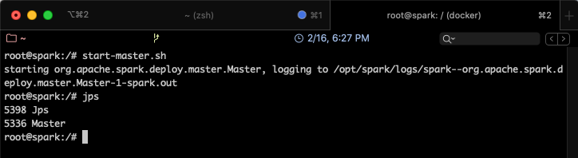

# Partie 3 - Installation de Spark
<center></center>


## Installation de Spark sur un seul Noeud
Pour installer Spark, nous allons utiliser des contenaires [Docker](https://www.docker.com/). Docker nous permettra de mettre en place un environnement complet, entièrement portable, sans rien installer sur la machine hôte, pour utiliser Spark de façon uniforme grâce aux lignes de commande.

Nous allons suivre les étapes suivantes pour installer l'environnement Spark sur une machine ubuntu.

### Étape 1 - Télécharger l'image de base
Avant de suivre les étapes suivantes, il faut commencer par installer Docker. Suivre les étapes se trouvant dans le lien suivant, suivant votre système d'exploitation:
[https://docs.docker.com/install/](https://docs.docker.com/install/)

Nous avons choisi Ubuntu comme environnement cible pour notre contenaire Docker. Nous commençons donc par télécharger l'image Ubuntu à partir de Docker Hub, avec la commande suivante:

```Bash
  docker pull ubuntu
```

Nous allons ensuite créer un contenaire à partir de l'image téléchargée.

```Bash
  docker run -itd -p 8080:8080 --name spark --hostname spark ubuntu
```
Nous avons lancé un nouveau contenaire intitulé _spark_ à partir de la machine ubuntu, en exposant sur le localhost son port 8080, pour pouvoir accéder à sa WebURL.
On pourra vérifier que la machine est bien démarrée en utilisant:

```bash
  docker ps
```

On devrait obtenir un résultat semblable au suivant:


Pour se connecter à la machine et la manipuler avec les lignes de commandes, utiliser:

```Bash
  docker exec -it spark bash
```

Le résultat sera comme suit:


!!! warning "Attention"
    Ces étapes sont faites une seule fois, à la première création de la machine. Si vous voulez relancer une machine déjà créée, suivre les étapes suivantes:

      * Vérifier que la machine n'est pas déjà démarrée. Pour cela, taper la commande suivante:
      ```
        docker ps
      ```
      * Si vous retrouvez le contenaire dans la liste affichée, vous pouvez exécuter la commande ```docker exec...``` présentée précédemment.

      * Sinon, vérifier que le contenaire existe bien, mais qu'il est juste stoppé, grâce à la commande:
      ```
        docker ps -a
      ```

      * Une fois le contenaire retrouvé, le démarrer, simplement en tapant la commande suivante:
      ```
        docker start spark
      ```

      Le contenaire sera lancé.
### Étape 2 - Installer Java
Afin d'installer Java sur la machine, commencer par mettre à jour les packages systèmes de Ubuntu:

```Bash
  apt update
  apt -y upgrade
```

Installer ensuite la version par défaut de Java:

```Bash
  apt install default-jdk
```

Vérifier la version de Java que vous venez d'installer:

```Bash
  java -version
```

### Étape 3 - Installer Scala
Installer Scala :

```bash
  apt install scala
```

### Étape 4 - Télécharger Spark
Pour installer Spark sur la machine docker, utiliser la commande suivante:

```Bash
  apt install curl
  curl -O https://archive.apache.org/dist/spark/spark-2.4.5/spark-2.4.5-bin-hadoop2.7.tgz
```

La version stable actuelle est 2.4.5, mais vous pouvez télécharger la version de votre choix. Vous retrouverez les liens de téléchargement de toutes les versions [ICI](https://archive.apache.org/dist/spark).

Extraire ensuite le fichier tgz:

```Bash
  tar xvf spark-2.4.5-bin-hadoop2.7.tgz
```

Déplacer le dossier obtenu vers le répertoire /opt comme suit:

```Bash
  mv spark-2.4.5-bin-hadoop2.7 /opt/spark
  rm spark-2.4.5-bin-hadoop2.7.tgz
```


### Étape 5 - Mise en place de l'environnement Spark
Nous devons mettre en place certains paramètres d'environnement pour assurer une bonne exécution de Spark:

  1. Ouvrir le fichier de configuration bashrc (installer [vim](https://www.vim.org/) si nécessaire avec ``` apt install vim ```)

  ```bash
    vim ~/.bashrc
  ```
  2. Ajouter les lignes suivantes à la fin du fichier (taper ```G``` pour aller à la fin du fichier, puis ```o``` pour insérer une nouvelle ligne et passer en mode édition)

  ```bash
    export SPARK_HOME=/opt/spark
    export PATH=$PATH:$SPARK_HOME/bin:$SPARK_HOME/sbin
  ```
  Quitter l'éditeur en tapant ```:wq```
  Activer les changements réalisés en tapant ```source ~/.bashrc``

### Étape 6 - Démarrer un serveur master en standalone
Il est désormais possible de démarrer un serveur en standalone, en utilisant la commande suivante:

```bash
  start-master.sh
```
Vous pourrez ensuite vérifier que votre serveur est bien démarré en tapant: ```jps```



Il suffit de plus, d'aller sur le navigateur de votre machine hôte, et d'ouvrir le lien: ```http://localhost:8080``` (après avoir vérifié que rien d'autre ne tourne sur le même port). L'interface Web de Spark s'affichera, comme suit:


On remarque que la fenêtre indique que le spark master se trouve sur ```spark://spark:7077```

### Étape 7 - Démarrer un processus Worker
Pour lancer un processus Worker, utiliser la commande suivante:

```bash
  start-slave.sh spark://spark:7077
```

Un nouveau processus sera lancé, qu'on pourra voir avec ```jps```


Vous pouvez maintenant lancer Spark Shell pour executer des Jobs Spark.

```bash
  spark-shell
```


## Installation de Spark sur un cluster
Nous allons maintenant procéder à l'installation de Spark sur un cluster, c'est à dire un ensemble de machines interconnectées, représentées dans notre cas par des contenaires Docker. L'objectif sera donc de créer un réseau de contenaires, installer Spark dessus, et lancer les processus sur les différents contenaires, de façon à obtenir le cluster suivant:

<center></center>

Pour réaliser cela, nous allons nous baser sur le contenaire créé précédemment, dans lequel nous avons installé Java et Spark.

### Étape 1 - Installer SSH

  1. Installer OpenSSH sur la machine :
  ```bash
    apt install openssh-server openssh-client
  ```
  2. Générer une paire de clefs (quand on vous le demande, valider le chemin par défaut proposé pour enregistrer la paire de clefs):
  ```bash
    ssh-keygen -t rsa -P ""
  ```
  3. Définir la clef générée comme clef autorisée:
  ```bash
    cp /root/.ssh/id_rsa.pub /root/.ssh/authorized_keys
  ```
  4. Programmer ssh pour qu'il soit lancé au démarrage du contenaire. Pour cela, ajouter les lignes suivantes à la fin du fichier ```~/.bashrc```:
  ```bash
    service ssh start
  ```


### Étape 2 - Configurer Spark
Il faudrait éditer le fichier de configuration ```spark-env.sh``` (se trouvant dans le répertoire ```$SPARK_HOME/conf```) pour ajouter les paramètres suivants:

  1. Créer une copie du template du fichier ```spark-env.sh``` et le renommer:
  ```bash
    cp $SPARK_HOME/conf/spark-env.sh.template $SPARK_HOME/conf/spark-env.sh
  ```
  2. Ajouter les deux lignes suivantes à la fin du fichier ```~/.bashrc``` (n'oubliez pas de le recharger après modification avec ```source ~/.bashrc```)
  ```bash
    export SPARK_WORKER_CORES=8
  ```
  3. Créer le fichier de configuration ```slaves```dans le répertoire ```$SPARK_HOME/conf```:
  ```bash
    vim $SPARK_HOME/conf/slaves
  ```
  4. Ajouter dans le fichier ```slaves``` les noms des contenaires workers (que nous allons créer tout à l'heure):
  ```bash
    spark-slave1
    spark-slave2
  ```

Vous avez configuré Spark pour supporter deux esclaves (_workers_ ou _slaves_) en plus du master.

### Étape 3 - Créer une image à partir du contenaire
Une fois le contenaire créé et configuré tel que présenté précédemment, nous allons le dupliquer pour en créer un cluster. Mais d'abord, il faut créer une image du contenaire, de façon à l'utiliser pour créer les deux autre contenaires.

Commencer par quitter le noeud _spark_ et retourner vers la machine hôte, en tapant ```exit```.

  1. Taper la commande suivante pour créer une image à partir du contenaire spark:

  ```bash
    docker commit spark spark-image
  ```

  ```commit``` permet de créer une nouvelle image ```spark-image``` à partir du contenaire ```spark```.

  Vérifier que ```spark-image``` existe bien en tapant: ```docker images```.

### Étape 4 - Créer le Cluster

Pour créer le cluster à partir de l'image déjà générée, suivre les étapes suivantes:

  1. Supprimer le contenaire spark précédemment créé:
  ```bash
    docker stop spark
    docker rm spark
  ```

  2. Créer un réseau qui permettra de connecter les trois noeuds du cluster:
  ```bash
    docker network create --driver=bridge spark-network
  ```
  3. Créer et lancer les trois contenaires (les instructions -p permettent de faire un mapping entre les ports de la machine hôte et ceux du contenaire):
  ```bash
    docker run -itd --net=spark-network -p 8080:8080 --expose 22 \
          --name spark-master --hostname spark-master \
          spark-image

    docker run -itd --net=spark-network --expose 22 \
          --name spark-slave1 --hostname spark-slave1 \
          spark-image

    docker run -itd --net=spark-network --expose 22 \
          --name spark-slave2 --hostname spark-slave2 \
          spark-image
  ```
  4. Vérifier que les trois contenaires sont bien créés:
  ```bash
    docker ps
  ```
  Vous devriez retrouver la liste des trois contenaires:
  

### Étape 5 - Démarrer les services Spark
Pour démarrer les services spark sur tous les noeuds, utiliser la commande suivante:

```bash
  start-all.sh
```

Vous obtiendrez le résultat suivant:


Pour vérifier que les services sont bien démarrés, aller sur le noeud Master et taper la commande ```jps```, vous trouverez le résultat suivant:


Si on fait la même chose sur un des slaves, on obtiendra le résultat suivant:

