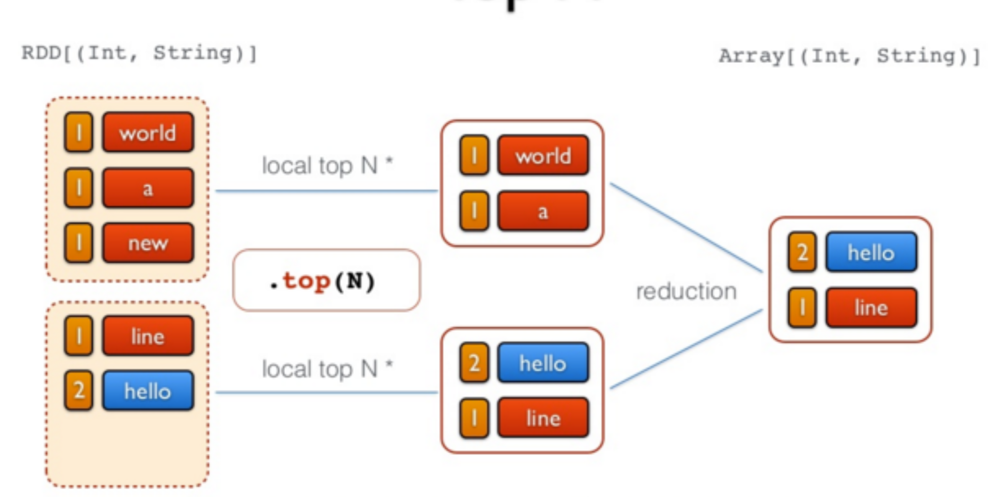
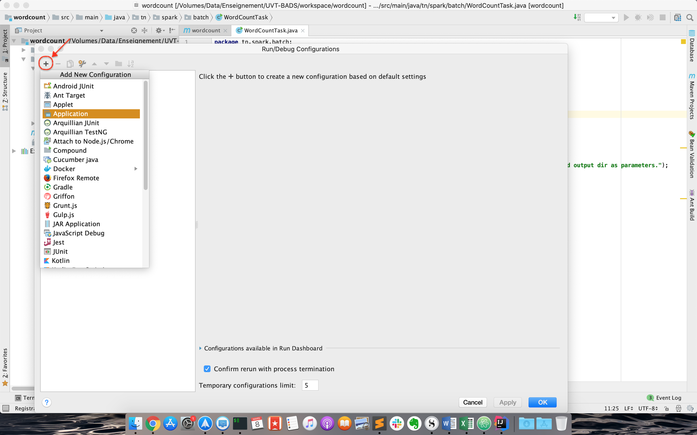
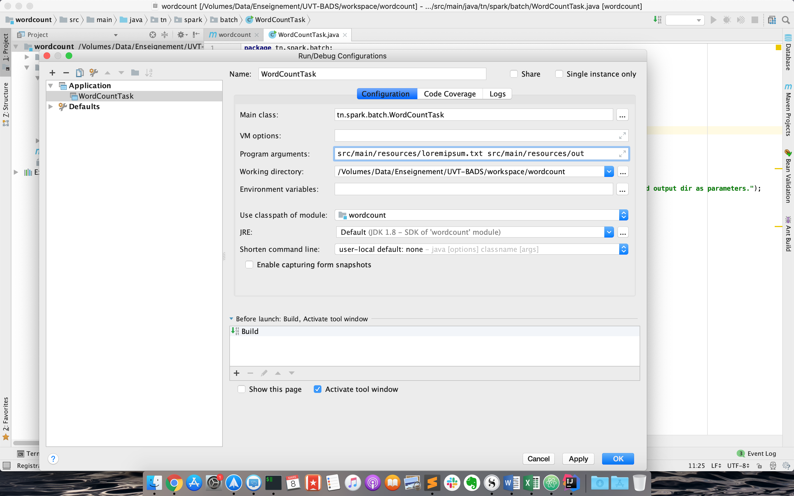

# Partie 4 - Spark RDD et Traitement par Lots
<center>[^sparkforbeginners]</center>

## RDD: Resilient Distributed Dataset
Spark gravite autour du concept de "Resilient Distributed Dataset" ou RDD, qui est une collection d'éléments tolérante aux fautes qui peut être gérée en parallèle. Les RDDs utilisent la mémoire et l'espace disque selon les besoins.

  * _R pour Résilient_: capable de récupérer rapidement en cas de problèmes ou de conditions difficiles,
  * _D pour Distribué_: partage les données sur les différents noeuds participants pour une exécution parallèle,
  * _D pour Dataset_: une collection de données composée d'éléments séparés mais qui sont manipulés comme une unité compacte.

Il existe deux moyens de créer les RDDs [^spark-official]:


  - Paralléliser une collection existante en mémoire dans le programme Driver.
  - Le générer à partir d'un fichier enregistré sur un support de stockage externe.

### Parallélisation de Collections
Les collections parallélisées sont créées en appelant la méthode `parallelize` du `JavaSparkContext` sur une collection existante dans votre programme Driver. Les éléments de la collection sont copiés pour former une structure distribuée qui peut être traitée en parallèle.

Par exemple, nous pouvons créer une collection parallélisée à partir d'une liste contenant les chiffres de 1 à 5:

```Java
  List<Integer> data = Arrays.asList(1, 2, 3, 4, 5);
  JavaRDD<Integer> distData = sc.parallelize(data);
```

Une fois créée, la structure distribuée `distData` peut être traitée en parallèle. Par exemple, il est possible d'appeler `distData.reduce((a,b)-> a + b)` pour faire la somme de tous les éléments de la liste.

Un paramètre important à définir dans une collection parallélisée, c'est le nombre de partitions à utiliser pour diviser la collection. Spark exécute une tâche pour chaque partition du cluster. En temps normal, Spark essaiera de définir le nombre de partitions automatiquement selon votre cluster, cependant, il est possible de le définir manuellement en le passant comme second paramètre de la fonction `parallelize`:

```Java
  sc.parallelize(data, 10)
```

### Génération à partir d'un fichier externe
Spark peut créer une collection distribuée à partir de n'importe quelle source de stockage supportée par Hadoop, incluant votre propre système de stockage, HDFS, Cassandra, HBase, Amazon S3, etc.

Il est possible de créer des RDDs à partir de fichiers texte en utilisant la méthode ```textfile``` du ```SparkContext```. Cette méthode prend l'URI du fichier (chemin du fichier local, ou bien en utilisant ```hdfs://``` ou ```s3://```), et le lit comme une collection de lignes. Par exemple:

```Java
JavaRDD<String> distFile = sc.textFile("data.txt");
```

## Opérations sur les RDDs
Les RDDs supportent deux types d'opérations:

  * les _transformations_, qui permettent de créer une nouvelle collection à partir d'un RDD existant
  * les _actions_, qui retournent une valeur au programme _driver_ après avoir exécuté un calcul sur le RDD.

  Par exemple, un _map_ est une transformation qui passe chaque élément du dataset via une fonction, et retourne un nouvel RDD représentant les résultats. Un _reduce_ est une action qui agrège tous les éléments du RDD en utilisant une certaine fonction et retourne le résultat final au programme.

  Toutes les transformations dans Spark sont _lazy_ (fainéantes), car elles ne calculent pas le résultat immédiatement. Elles se souviennent des transformations appliquées à un dataset de base (par ex. un fichier). Les transformations ne sont calculées que quand une action nécessite qu'un résultat soit retourné au programme principal. Cela permet à Spark de s'exécuter plus efficacement.

<center>[^devopedia]</center>


### Exemple

L'exemple que nous allons présenter ici par étapes permet de relever les mots les plus fréquents dans un fichier. Pour cela, le code suivant est utilisé:

```Scala
  //Etape 1 - Créer un RDD à partir d'un fichier texte
  val docs = spark.textFile("/docs")
```
<center></center>

```Scala
  //Etape 2 - Convertir les lignes en minuscule
  val lower = docs.map(line => line.toLowerCase)
```
<center></center>

```Scala
  //Etape 3 - Séparer les lignes en mots
  val words = lower.flatMap(line => line.split("\\s+"))
```
<center></center>

```Scala
  //Etape 4 - produire les tuples (mot, 1)
  val counts = words.map(word => (word,1))
```
<center></center>

```Scala
  //Etape 5 - Compter tous les mots
  val freq = counts.reduceByKey(_ + _)
```
<center></center>

```Scala
  //Etape 6 - Inverser les tuples (transformation avec swap)
  freq.map(_.swap)
```
<center></center>

```Scala
  //Etape 7 - Inverser les tuples (action de sélection des n premiers)
  val top = freq.map(_swap).top(N)
```
<center></center>

## Test de Spark avec Spark-Shell

Nous allons tester le comportement de Spark et des RDD en utilisant l'exemple type pour l'analyse des données: le Wordcount, qui permet de compter le nombre de mots dans un fichier donné en entrée.

Commençons par lancer le cluster Spark installé dans la partie [P3](../p3-install/index.html).

```bash
  docker start spark-master spark-slave1 spark-slave2
```

Entrer dans le noeud Master comme suit:

```bash
  docker exec -it spark-master bash
```

Dans le but de tester l'exécution de spark, commencer par créer un fichier _input/file1.txt_ dans le répertoire ```/root```:

```bash
  mkdir /root/input
  vim /root/input/file1.txt
```

Remplir le fichier avec le texte suivant, ou tout texte de votre choix (vous devez taper ```i``` pour passer en mode édition):

```text
  Hello Spark Wordcount!
  Hello everybody else!
```


Lancer Spark Shell en utilisant la commande suivante:
```Bash
  spark-shell
```

Vous devriez avoir un résultat semblable au suivant:


Vous pourrez tester spark avec un code scala simple comme suit (à exécuter ligne par ligne):

```Scala
  val lines = sc.textFile("/root/input/file1.txt")
  val words = lines.flatMap(_.split("\\s+"))
  val wc = words.map(w => (w, 1)).reduceByKey(_ + _)
  wc.saveAsTextFile("/root/file1.count")
```

Ce code vient de (1) charger le fichier _file1.txt_ du système de fichier courant, (2) séparer les mots selon les caractères d'espacement, (3) appliquer un _map_ sur les mots obtenus qui produit le couple (_<mot\>_, 1), puis un _reduce_ qui permet de faire la somme des 1 des mots identiques.

Pour afficher le résultat, sortir de spark-shell en cliquant sur _Ctrl-C_. Afficher ensuite le contenu du fichier _part-00000_ du répertoire _file1.count_ créé, comme suit:
```Bash
  cat /root/file1.count/part-00000
```
Le contenu des deux fichiers _part-00000_ et _part-00001_ ressemble à ce qui suit:

<center></center>

## Spark Batch en Java
### Préparation de l'environnement et Code
Nous allons dans cette partie créer un projet Spark Batch en Java (un simple WordCount), le charger sur le cluster et lancer le job.

  1. Sur votre propre machine, créer un projet Maven avec IntelliJ IDEA (ou tout IDE de votre choix), en utilisant la config suivante:
  ```xml
    <groupId>spark.batch</groupId>
    <artifactId>wordcount</artifactId>
    <version>1</version>
  ```
<center></center>
  2. Rajouter dans le fichier pom les dépendances nécessaires, et indiquer la version du compilateur Java:
  ```xml
  <properties>
      <maven.compiler.source>1.8</maven.compiler.source>
      <maven.compiler.target>1.8</maven.compiler.target>
  </properties>
  <dependencies>
      <!-- https://mvnrepository.com/artifact/org.apache.spark/spark-core -->
      <dependency>
          <groupId>org.apache.spark</groupId>
          <artifactId>spark-core_2.12</artifactId>
          <version>2.4.5</version>
      </dependency>
  </dependencies>
  ```
  3. Sous le répertoire java, créer un package que vous appellerez _tn.spark.batch_, et dedans, une classe appelée _WordCountTask_.
  4. Écrire le code suivant dans _WordCountTask_:

  ```java
  package tn.spark.batch;

  import org.apache.spark.SparkConf;
  import org.apache.spark.api.java.JavaPairRDD;
  import org.apache.spark.api.java.JavaRDD;
  import org.apache.spark.api.java.JavaSparkContext;
  import org.slf4j.Logger;
  import org.slf4j.LoggerFactory;
  import scala.Tuple2;

  import java.util.Arrays;

  import static jersey.repackaged.com.google.common.base.Preconditions.checkArgument;
  public class WordCountTask {
      private static final Logger LOGGER = LoggerFactory.getLogger(WordCountTask.class);

      public static void main(String[] args) {
          checkArgument(args.length > 1, "Please provide the path of input file and output dir as parameters.");
          new WordCountTask().run(args[0], args[1]);
      }

      public void run(String inputFilePath, String outputDir) {
          String master = "local[*]";
          SparkConf conf = new SparkConf()
                  .setAppName(WordCountTask.class.getName())
                  .setMaster(master);
          JavaSparkContext sc = new JavaSparkContext(conf);

          JavaRDD<String> textFile = sc.textFile(inputFilePath);
          JavaPairRDD<String, Integer> counts = textFile
                  .flatMap(s -> Arrays.asList(s.split(" ")).iterator())
                  .mapToPair(word -> new Tuple2<>(word, 1))
                  .reduceByKey((a, b) -> a + b);
          counts.saveAsTextFile(outputDir);
      }
  }
  ```

La première chose à faire dans un programme Spark est de créer un objet _JavaSparkContext_, qui indique à Spark comment accéder à un cluster. Pour créer ce contexte, vous aurez besoin de construire un objet _SparkConf_ qui contient toutes les informations sur l'application.

  * _appName_ est le nom de l'application
  * _master_ est une URL d'un cluster Spark, Mesos ou YARN, ou bien une chaîne spéciale _local_ pour lancer le job en mode local.

!!! warning
      Nous avons indiqué ici que notre master est _local_ pour les besoins du test, mais plus tard, en le packageant pour le cluster, nous allons enlever cette indication. Il est en effet déconseillé de la hard-coder dans le programme, il faudrait plutôt l'indiquer comme option de commande à chaque fois que nous lançons le job.

Le reste du code de l'application est la version en Java de l'exemple en scala que nous avions fait avec spark-shell.

### Test du code en local
Pour tester le code sur votre machine, procéder aux étapes suivantes:

  1. Créer un fichier texte de votre choix (par exemple le fameux loremipsum.txt, que vous pourrez générer [ici](https://generator.lorem-ipsum.info/_latin)) dans le répertoire src/main/resources.
  2. Créer une nouvelle configuration de type "Application" (_Run->Edit Configurations_):
<center></center>
<center></center>
  3. La nommer _WordCountTask_, et définir les arguments suivants (fichier de départ et répertoire d'arrivée) comme _Program arguments_:
  ```
    src/main/resources/loremipsum.txt src/main/resources/out
  ```
<center></center>
  3. Cliquer sur OK, et lancer la configuration. Si tout se passe bien, un répertoire _out_ sera créé sous _resources_, qui contient deux fichiers: part-00000, part-00001.

<center></center>

### Lancement du code sur le cluster
Pour exécuter le code sur le cluster, modifier comme indiqué les lignes en jaune dans ce qui suit:

```java hl_lines="11 12"
public class WordCountTask {
  private static final Logger LOGGER = LoggerFactory.getLogger(WordCountTask.class);

  public static void main(String[] args) {
      checkArgument(args.length > 1, "Please provide the path of input file and output dir as parameters.");
      new WordCountTask().run(args[0], args[1]);
  }

  public void run(String inputFilePath, String outputDir) {

      SparkConf conf = new SparkConf()
              .setAppName(WordCountTask.class.getName());

      JavaSparkContext sc = new JavaSparkContext(conf);

      JavaRDD<String> textFile = sc.textFile(inputFilePath);
      JavaPairRDD<String, Integer> counts = textFile
              .flatMap(s -> Arrays.asList(s.split(" ")).iterator())
              .mapToPair(word -> new Tuple2<>(word, 1))
              .reduceByKey((a, b) -> a + b);
      counts.saveAsTextFile(outputDir);
  }
}
```

Lancer ensuite une configuration de type Maven, avec les commandes _package install_.
<center></center>

Un fichier intitulé _worcount-1.jar_ sera créé sous le répertoire _target_.

Nous allons maintenant copier ce fichier dans docker. Pour cela, naviguer vers le répertoire du projet avec votre terminal (ou plus simplement utiliser le terminal dans IntelliJ), et taper la commande suivante:

```Bash
  docker cp target/wordcount-1.jar spark-master:/root/wordcount-1.jar
```

Copier également le fichier _loremipsum.txt_ que vous avez créé dans votre projet:

```Bash
  docker cp src/main/resources/loremipsum.txt spark-master:/root/input/loremipsum.txt
```

Aller à votre contenaire spark-master (en utilisant la commande ```docker exec ...```), et lancer un job Spark en utilisant ce fichier jar généré, avec la commande ```spark-submit```, un script utilisé pour lancer des applications spark sur un cluster.

```Bash
  cd /root
  spark-submit  --class tn.spark.batch.WordCountTask --master local wordcount-1.jar input/loremipsum.txt output
```

  * Nous avons lancé le job en mode local, pour commencer.
  * Le fichier en entrée est le fichier loremipsum.txt, et le résultat sera stocké dans un répertoire _output_.


Si tout se passe bien, vous devriez trouver, dans le répertoire _output_, un fichier part-00000, qui ressemble à ce qui suit:

<center></center>

## Références

  [^sparkforbeginners]:
  Spark for beginners, _RDD in Spark_, [http://sparkforbeginners.blogspot.com/2016/05/rdd-in-spark.html](http://sparkforbeginners.blogspot.com/2016/05/rdd-in-spark.html), consulté le 03/2020

  [^spark-official]:
  Spark Documentation, _Resilient Distributed Datasets(RDDs)_, [https://spark.apache.org/docs/latest/rdd-programming-guide.html#resilient-distributed-datasets-rdds](https://spark.apache.org/docs/latest/rdd-programming-guide.html#resilient-distributed-datasets-rdds), consulté le 03/2020

  [^devopedia]:
  Devopedia, _Apache Spark_, [https://devopedia.org/apache-spark](https://devopedia.org/apache-spark), consulté le 03/2020
