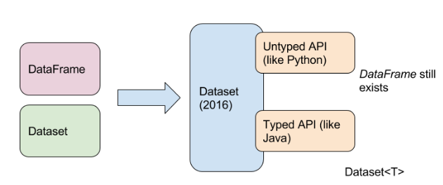
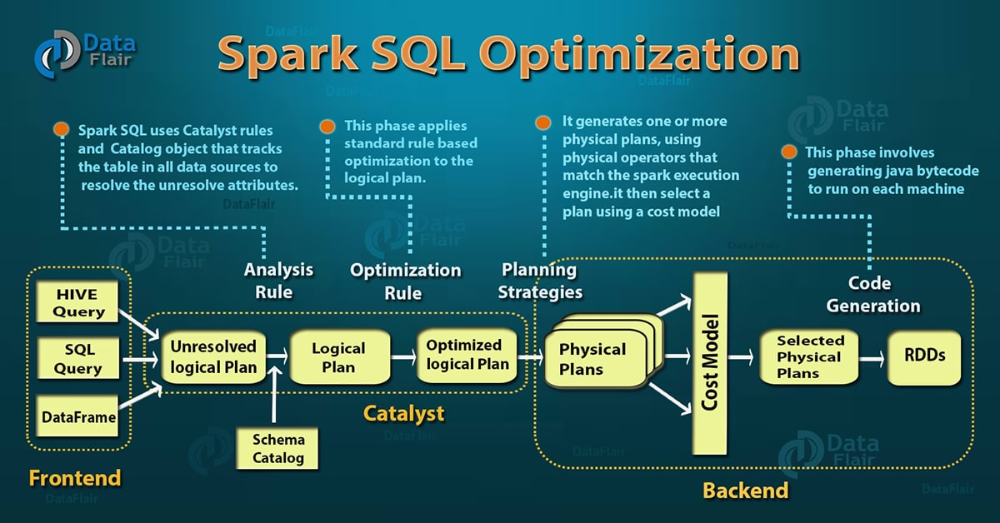
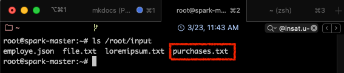
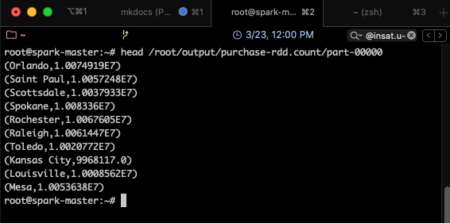
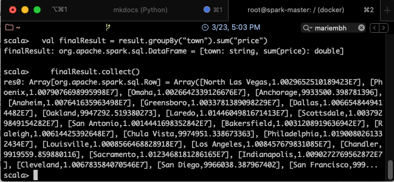

# Partie 5 - Spark SQL
<center></center>

## Présentation de Spark SQL
Spark SQL[^spark-official] est un module de Spark pour le traitement des données structurées. Contrairement aux RDD, les interfaces fournies par Spark SQL informent Spark de la structure des données et traitements réalisés. En interne, Spark SQL utilise ces informations pour réaliser des optimisations.

Il est possible d'interagir avec Spark SQL de deux façons: en utilisant SQL et l'API Dataset. Pour ces deux interfaces, le même moteur d'exécution est utilisé par Spark SQL, ce qui permet aux développeurs de passer facilement d'une API à une autre.

### SQL
SQL est utilisé comme langage de requêtage dans Spark SQL. Ce dernier peut également lire des données à partir d'une installation Hive existante. En exécutant des requêtes SQL à partir d'autres langages de programmation, le résultat est retourné sous forme de Dataset ou DataFrame.

### Datasets et DataFrames

Un DataFrame est une structure organisée en colonnes nommées et non typées. Il est conceptuellement équivalent à une table dans une base de données relationnelle ou un data frame en Python ou R, avec en plus des optimisations plus riches. Ils ont été conçus comme couche au dessus des RDDs, pour ajouter des métadonnées supplémentaires grâce à leur format tabulaire.
Les DataFrames peuvent être construites à partir de fichiers structurés, tables dans Hive, bases de données externes ou de RDDs existants.

Un Dataset est une collection distribuée de données typées. C'est une nouvelle structure ajoutée dans Spark 1.6 qui fournit les avantages des RDDs en plus de ceux du moteur d'exécution optimisé de Spark SQL. C'est principalement une amélioration des DataFrames, qui y rajoute le typage des données. Un dataset peut être constuit à partir d'objets de la JVM, puis manipulé en utilisant les transformations telles que ```map, flatMap, filter,``` etc.

A partir de la version 2 de Spark, les APIs des Datasets et DataFrame sont unifiées. Désormais, un DataFrame est référencé comme étant un ```Dataset[Row]```.
<center></center>

Le tableau suivant permet de comparer les trois structures (RDD, Dataset et DataFrame) selon plusieurs critères [^zenika]:

<center></center>

## Caractéristiques de Spark SQL

<center>[^data-flair]</center>

  * **Intégré**: Permet de mixer les programmes Spark avec les requêtes SQL, ce qui autorise un requêtage de données structurées grâce à SQL ou à l'API Dataframe en Java, Scala, Python et R.
  * **Accès unifié aux données**: Les Dataframes et SQL dans Spark communiquent de façon unifiée avec plusieurs sources de données telles que Hive, Avro, Parquet, JSON et JDBC.
  * **Compatible avec Hive**: Exécute des requêtes Hive sans modification sur les données courantes. Spark SQL réécrit le frontend de Hive, permettant une compatibilité complète avec les données, requêtes et UDFs de Hive.
  * **Connectivité standard**: La connexion peut se faire via JDBC ou ODBC.
  * **Performance et scalabilité**: Spark SQL incorpore un optimiseur, un générateur de code et un stockage orienté colonnes. De plus, il profite de la puissance du moteur Spark, qui fournit une excellente tolérance au fautes.

## Optimisation de Spark SQL avec Catalyst

Le framework d'optimisation de Spark SQL permet aux développeurs d'exprimer des requêtes de transformation en très peu de lignes de code.

<center>[^data-flair]</center>

Spark SQL incorpore un optimiseur appelé Catalyst, basé sur des constructions fonctionnelles en Scala. Il supporte une optimisation à base de règles (_rule-based_) et à base de coût (_cost_based_). L'optimisation à base de règles utilise un ensemble de règles pour déterminer comment exécuter une requête donnée, alors que l'optimisation à base de coût trouve le meilleur moyen pour exécuter une requête SQL. Cette dernière catégorie génère plusieurs règles, calcule les coûts induits par chacune, et choisit la plus optimisée.

En interne, Catalyst contient une bibliothèque pour représenter des arbres et appliquer des règles pour les manipuler. Par dessus, d'autres bibliothèques ont été construites pour assurer le traitement de requêtes relationnelles, ainsi que plusieurs règles qui gèrent différentes phases de l'exécution des requêtes: analyse, optimisation logique, planification physique et génération de code, pour compiler des parties de la requête en Bytecode Java.  Pour cette dernière opération, une autre caractéristique de Scala, les _quasiquotes_, est utilisée, pour faciliter la génération de code à l'exécution à partir d'expressions composables.[^databricks]

## Manipulation de Spark SQL avec le Shell

### RDD vs DataFrame vs Dataset
Nous allons dans cette partie vous montrer les différences entre ces trois structures de données, en utilisant du code, inspiré d'un tutoriel de Zenika [^zenika].

Supposons qu'on ait le fichier _purchases.txt_, qui contient la totalité des achats réalisés dans une grande distribution, dont la structure est la suivante:
  ``` date,  heure,  ville,  categorie_pdt,  prix,  moyen_paiement```
Nous voulons réaliser une opération de Map Reduce simple, où nous allons calculer pour chaque ville, la somme totale des ventes réalisées.

En premier lieu, nous allons commencer par charger le fichier _purchases.txt_ dans le répertoire input de notre cluster spark.

  1. Commencer par démarrer votre cluster (si ce n'est pas déjà fait):
  ```Bash
    docker start spark-master spark-slave1 spark-slave2
  ```
  2. Entrer dans le master
  ```Bash
    docker exec -it spark-master bash
  ```
  3. Naviguer vers le répertoire input précédemment créé:
  ```Bash
    cd ~/input
  ```
  4. Télécharger le fichier purchases sur votre ordinateur à partir de ce [LIEN](https://mohetn-my.sharepoint.com/:t:/g/personal/lilia_sfaxi_insat_u-carthage_tn/EWdosZTuyDtEiqcjpqbY_loBJfMEGxsYHDYHl6hBpzVAhg?e=AVUJal) (ceci peut prendre quelques minutes).
  5. Charger le fichier téléchargé dans votre master grâce à la commande ```docker cp``` (il faudra ouvrir un autre terminal )
  ```Bash
    docker cp <chemin_de_purchases.txt>/purchases.txt spark-master://root/input
  ```
  6. Si tout se passe bien, vous devriez retrouver le fichier purchases dans le répertoire input. Revenir dans votre contenaire spark, et taper:
  ```Bash
    ls /root/input
  ```
Le fichier devrait apparaître:
<center></center>

#### Utilisation des RDD
Nous allons exécuter l'opération de calcul sur les données grâce aux structures RDD. Pour cela, suivre les étapes suivantes:

  1. Dans votre contenaire spark-master, ouvrir spark-shell:
  ```bash
    spark-shell
  ```
  2. Charger le fichier purchases dans un RDD
  ```scala
    val allData = sc.textFile("/root/input/purchases.txt")
  ```
  3. Transformation 1: séparer les champs
  ```scala
    val splitted = allData.map(line => line.split("\t"))
  ```
  4. Transformation 2: extraire les couples clef-valeur
  ```scala
    val pairs = splitted.map(splitted => (splitted(2), splitted(4).toFloat))
  ```
  5. Transformation 3: réaliser la somme des prix de vente pour chaque clef
  ```scala
    val finalResult = pairs.reduceByKey(_+_)
  ```
  6. Action : sauvegarder le résultat dans un fichier texte
  ```scala
    finalResult.saveAsTextFile("/root/output/purchase-rdd.count")
  ```
  7. Ouvrir le fichier texte et visualiser le résultat (sortir de spark-shell pour cela avec ```Ctrl-C```)
  ```bash
    head /root/output/purchase-rdd.count/part-00000
  ```

Le résultat obtenu devrait ressembler à ce qui suit:
<center></center>

Toutes les transformations représentées ci-dessus produisent des RDD distribués sur les workers. La transformation 3 (_reduceByKey_) réalise ce qu'on appelle une **transformation large** (ou _wide transformation_) où une partition du RDD est produite à partir de plusieurs partitions du RDD parent, contrairement aux **transformations étroites** (ou _narrow transformations_) où chaque partition du RDD fils est créée à partir d'une seule partition du RDD parent (tel que indiqué dans la figure suivante).

<center></center>

#### Utilisation des DataFrames

Contrairement aux RDD, les DataFrames sont non typées. En effet, même si ce n'est pas visible dans le code précédent, car on utilise le langage Scala qui infère les types des variables, les RDD créés sont de type RDD[String]. En ce qui concerne les DataFrames, par contre, les types ne sont pas définis, par contre, la structure des données l'est. C'est à dire que nous pouvons faire référence à chacun des champs par son nom, défini préalablement dans un schéma, tel une base de données.

  1. Commencer par importer les classes nécessaires dans Spark-shell
  ```scala
    import org.apache.spark.sql.types.{StructType, StructField, StringType, FloatType};
  ```
  2. Définir le schéma des données qui se trouvent dans le fichier _purchases.txt_ que nous allons charger
  ```scala
    val customSchema = StructType(Seq(StructField("date", StringType, true), StructField("time", StringType, true), StructField("town", StringType, true), StructField("product", StringType, true), StructField("price", FloatType, true), StructField("payment", StringType, true)))
  ```
  3. Lire le fichier comme étaht un document CSV (_Comma-separated Values_), et mapper le résultat avec le schéma défini
  ```scala
    val resultAsACsvFormat = spark.read.schema(customSchema).option("delimiter", "\t").csv("/root/input/purchases.txt")
  ```
  4. Grouper les données par ville et faire la somme des prix
  ```scala
    val finalResult = resultAsACsvFormat.groupBy("town").sum("price")
  ```
  5. Sauvegarder les résultats dans un fichier
  ```scala
    finalResult.rdd.saveAsTextFile("/root/output/purchase-df.count")
  ```

On remarque qu'il n'est pas possible de sauvegarder les DataFrame dans un fichier directement. Il faudra les transformer en RDD d'abord. De plus, les résultats seront sauvegardés sur un grand nombre de fichiers, certains vides.


Pour visualliser le résultat complet, il est possible d'utiliser l'action _finalResult.collect()_, qui permet de retourner le RDD complet au programme Driver. Cela suppose bien sûr que le RDD peut être chargé en entier dans la mémoire de la machine master.

Le résultat qu'on obtient alors sera comme suit:
<center></center>

!!! warning "Attention"
    Il est possible que la fonction _collect_ ne fonctionne pas si la version de Java n'est pas compatible avec Spark. Un message du type "```Unsupported class file major version 55```" s'affichera alors.
    Pour éviter cela, installer la version 1.8 de JDK avec ```apt install openjdk-8-jdk```, puis ajouter les lignes suivantes à ```~/.bashrc```:
    ```bash
      export JAVA_HOME=/usr/lib/jvm/java-8-openjdk-amd64/
      export PATH=$JAVA_HOME/bin:$PATH
    ```
    Charger le fichier .bashrc en utilisant ```source ~/.bashrc```, puis vérifier que la version de Java a bien changé en utilisant: ```java -version```. L'affichage suivant devra apparaître:
    <center></center>

#### Utilisation des Datasets
Les Datasets sont une amélioration des DataFrames, qui y rajoutent le typage. Les données ont donc une structure bien définie, mais en plus, telles que les bases de données relationnelles, un type pour chaque élément.

Pour utiliser les Datasets comme structure de données dans notre exemple, suivre les étapes suivantes:

  1. Importer les classes nécessaires dans Spark-shell, et définir le schéma des données
  ```scala
    import org.apache.spark.sql.types.{StructType, StructField, StringType, FloatType};

    val customSchema =  StructType(Seq(StructField("date", StringType, true),
                        StructField("time", StringType, true), StructField("town", StringType, true),
                        StructField("product", StringType, true), StructField("price", FloatType, true),
                        StructField("payment", StringType, true)))
  ```
  2. Créer une classe associée à ce schéma
  ```scala
    case class Product(date: String, time: String, town:String, product:String, price:Float, payment:String)
  ```
  3. Lire le fichier comme étaht un document CSV (_Comma-separated Values_), en y associant la classe créée
  ```scala
    val result = spark.read.schema(customSchema).option("delimiter", "\t").csv("/root/input/purchases.txt").as[Product]
  ```
  4. Grouper, faire la somme et afficher le résultat
  ```scala
    val finalResult = result.groupBy("town").sum("price")
    finalResult.collect()
  ```

  Le résultat ressemblera à ce qui suit:
  <center></center>

### Exemple Spark SQL avec Scala

Nous allons montrer dans ce qui suit un exemple SparkSQL simple[^tutorialspoint], qui lit à partir de données se trouvant sur un fichier JSON, et interroge les donnees en utilisant les DataFrames et les opérations de transformations et actions optimisées de Spark.

  1. Commencer par créer un fichier JSON intitulé ```employe.json``` dans le répertoire /root/input de votre spark-master, avec le contenu suivant:
  ```json
    {"id" : "1201", "name" : "ahmed", "age" : "25"}
	{"id" : "1202", "name" : "salma", "age" : "58"}
	{"id" : "1203", "name" : "amina", "age" : "39"}
	{"id" : "1204", "name" : "ali", "age" : "23"}
	{"id" : "1205", "name" : "mourad", "age" : "23"}
  ```
  Le fichier doit contenir une liste de documents JSON successifs.
  2. Démarrer ensuite le Spark-Shell
  ```bash
    spark-shell
  ```
  3. Définir le SQL context
  ```scala
    val sqlcontext = new org.apache.spark.sql.SQLContext(sc)
    // Résultat: sqlcontext: org.apache.spark.sql.SQLContext = org.apache.spark.sql.SQLContext@75b41ff3
  ```
  4. Lire le contenu du fichier et le charger dans un DataFrame
  ```scala
    val dfs = sqlcontext.read.json("/root/input/employe.json")
    // Résultat: dfs: org.apache.spark.sql.DataFrame = [age: string, id: string ... 1 more field]
  ```
  5. Afficher le contenu du fichier.
  ```scala
    dfs.show()
    /* Résultat:
     +---+----+------+
     |age|  id|  name|
     +---+----+------+
     | 25|1201| ahmed|
     | 58|1202| salma|
     | 39|1203| amina|
     | 23|1204|   ali|
     | 23|1205|mourad|
     +---+----+------+
    */
  ```
  6. Afficher le schéma inféré des données
  ```scala
    dfs.printSchema()
    /* Résultat:
      root
        |-- age: string (nullable = true)
        |-- id: string (nullable = true)
        |-- name: string (nullable = true)
    */
  ```
  7. Sélectionner les noms des employés
  ```scala
    dfs.select("name").show()
    /* Résultat:
      +------+
      |  name|
      +------+
      | ahmed|
      | salma|
      | amina|
      |   ali|
      |mourad|
      +------+
    */
  ```
  8. Filter les données par âge
  ```scala
    dfs.filter(dfs("age") > 23).show()
    /* Résultat:
      +---+----+-----+
      |age|  id| name|
      +---+----+-----+
      | 25|1201|ahmed|
      | 58|1202|salma|
      | 39|1203|amina|
      +---+----+-----+
    */
  ```
  9. Grouper les données par âge et compter le nombre de personnes pour chaque âge
  ```scala
    dfs.groupBy("age").count().show()
    /* Résultat:
      +---+-----+
      |age|count|
      +---+-----+
      | 23|    2|
      | 25|    1|
      | 58|    1|
      | 39|    1|
      +---+-----+
    */
  ```

## Références

  [^spark-official]:
  Spark Documentation, _Spark SQL, DataFrames and Datasets Guide_, [https://spark.apache.org/docs/latest/sql-programming-guide.html](https://spark.apache.org/docs/latest/sql-programming-guide.html), consulté le 03/2020

  [^zenika]:
  Nastasia Saby from Zenika, _A comparison between RDD, DataFrame and Dataset in Spark from a developer's point of view_, [https://medium.zenika.com/a-comparison-between-rdd-dataframe-and-dataset-in-spark-from-a-developers-point-of-view-a539b5acf734](https://medium.zenika.com/a-comparison-between-rdd-dataframe-and-dataset-in-spark-from-a-developers-point-of-view-a539b5acf734), consulté le 03/2020

  [^data-flair]:
  Data Flair, _Spark Tutorial: Learn Spark Programming_, [https://data-flair.training/blogs/spark-tutorial/](https://data-flair.training/blogs/spark-tutorial/), consulté le 03/2020

  [^databricks]:
  DataBricks, _Deep Dive into Spark SQL's Catalyst Optimizer_, [https://databricks.com/blog/2015/04/13/deep-dive-into-spark-sqls-catalyst-optimizer.html](https://databricks.com/blog/2015/04/13/deep-dive-into-spark-sqls-catalyst-optimizer.html), consulté le 03/2020

  [^tutorialspoint]:
  TutorialsPoint, _SparkSQL Tutorial_, [https://www.tutorialspoint.com/spark_sql/spark_sql_dataframes.htm](https://www.tutorialspoint.com/spark_sql/spark_sql_dataframes.htm), consulté le 03/2020
