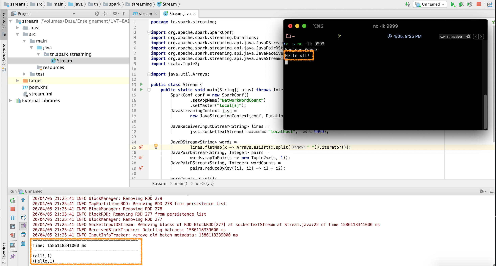
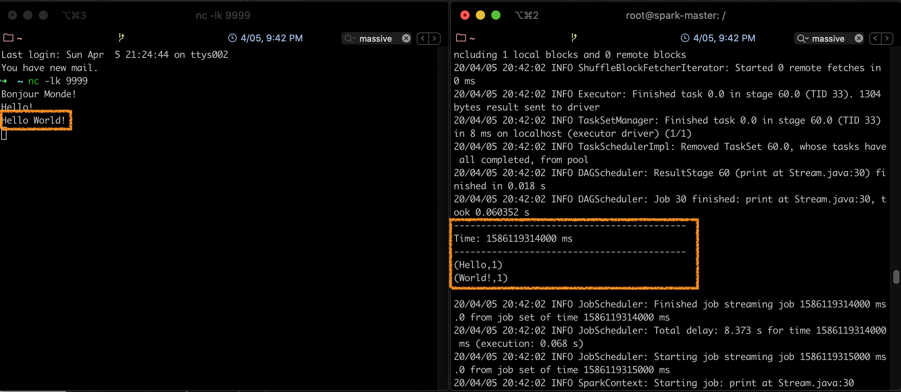

# Partie 6 - Spark Streaming
<center></center>

## Présentation de Spark Streaming
Un flux de données (ou _data stream_) est une séquence non bornée de données qui arrive de manière continue. Le streaming divise le flux continu des données en unités discrètes pour les traiter. Le traitement de flux est un traitement à faible latence, et une analyse des données en streaming.

**Spark Streaming** a été ajouté à Apache Spark en 2013, comme extension de l'API de base de Spark, qui fournit un traitement de flux scalable, à haut débit et tolérant aux fautes. L'ingestion de données peut être réalisée par plusieurs outils tels que [Apache Kafka](https://kafka.apache.org/), [Apache Flume](https://flume.apache.org/) ou [Amazon Kinesis](https://aws.amazon.com/kinesis/), et le traitement peut être fait grâce à des algorithmes complexes, exprimés par des fonctions de haut niveau tel que _map_, _reduce_, _join_, etc. Finalement, les données traitées peuvent être envoyées vers des systèmes de fichiers, bases de données ou tableaux de bord en temps réels. Il est même possible de réaliser des algorithmes de machine learning et de traitement de graphes sur les flux de données.

<center></center>

En interne, il fonctionne comme suit: Spark Streaming reçoit des données en streaming et les divise en micro-batches, qui sont ensuite calculés par le moteur de spark pour générer le flux final de résultats.

<center></center>

Au lieu de traiter les flux de données un élément à la fois, Spark Streaming les discrétise en micro-lots. En d'autres termes, les récepteurs de Spark Streaming acceptent les données en parallèle et les envoient sur la mémoire des noeuds Workers de Spark. Ensuite, le moteur optimisé de Spark exécuter de courtes tâches pour traiter les lots et envoyer les résultats à d'autre systèmes.

Contrairement au modèle d'opérateur continu, où le traitement est statiquement alloué à un noeud, les tâches de Spark sont affectées aux Workers de façon dynamique, sur la base de la localité des données et des ressources disponibles. Ceci permet une meilleure répartition des charges et une récupération plus rapide en cas de faute.

Chaque lot de données est un RDD dans Spark. Ceci permet aux données en streaming d'être traitées grâche à n'importe quel code ou bibliothèque Spark.

## Les DStreams
Spark Streaming divise le flux de données en lots appelés DStream (_Discretized Stream_), qui représentent fondamentalement une séquence de RDDs.

<center>[^data-flair]</center>

Spark DStream est l'abstraction de base de Spark Streaming. C'est un flux continu de données, qui reçoit en entrée des données à partir de sources diverses. Il peut également être un flux de données généré à partir d'un flux en entrée. DStream est un flux continu de RDD. Chaque RDD contient des données sur un intervalle particulier.

Chaque opération sur un DStream s'applique à tous les RDD sous-jacents. DStream offre ainsi au développeur une API de haut niveau pour faciliter le travail sur les données en streaming.

Les opérations sur le DStreams peuvent être:

  * **Transformations**: qui peuvent être:
    - Sans état (_Stateless_): ce sont des transformations où le traitement sur un lot n'a pas de dépendance avec les lots précédents. Les transformations sans état sont de simples transformations RDD. Elles s'appliquent sur chaque batch (et sur chaque RDD) du DStream. Ceci inclut des transformations classiques telles que _map_, _filter_, _reduceByKey_, etc.
    - Avec état (_Stateful_): ces transformations utilisent des données ou des résultats intermédiaires provenant des batches précédents. Les transformations avec état sont des opérations sur les DStreams qui suivent l'évolution des données à travers le temps. Les deux types de transformations avec état sont les _windowed operations_, qui opèrent sur une fenêtre glissante de périodes de temps, et la _updateStateByKey_, utilisée pour suivre l'état à travers les évènements de chaque clef.
  * **Output Operations**: elles sont réalisées pour renvoyer un résultat après les transformations. C'est l'équivalent des _actions_ pour les RDDs. On peut citer: _print_, _save_, etc.

## Environnement et Code
Nous allons commencer par tester le streaming en local, comme d'habitude. Pour cela:

  1. Commencer par créer un nouveau projet Maven, avec le fichier pom suivant:
  ```xml
  <?xml version="1.0" encoding="UTF-8"?>
  <project xmlns="http://maven.apache.org/POM/4.0.0"
         xmlns:xsi="http://www.w3.org/2001/XMLSchema-instance"
         xsi:schemaLocation="http://maven.apache.org/POM/4.0.0 http://maven.apache.org/xsd/maven-4.0.0.xsd">
    <modelVersion>4.0.0</modelVersion>

    <groupId>spark.streaming</groupId>
    <artifactId>stream</artifactId>
    <version>1</version>

    <dependencies>
        <dependency>
            <groupId>org.apache.spark</groupId>
            <artifactId>spark-core_2.11</artifactId>
            <version>2.2.1</version>
        </dependency>
        <dependency>
            <groupId>org.apache.spark</groupId>
            <artifactId>spark-streaming_2.11</artifactId>
            <version>2.2.1</version>
        </dependency>
    </dependencies>
    <build>
        <plugins>
            <plugin>
                <groupId>org.apache.maven.plugins</groupId>
                <artifactId>maven-compiler-plugin</artifactId>
                <version>3.1</version>
                <configuration>
                    <source>1.8</source>
                    <target>1.8</target>
                </configuration>
            </plugin>
        </plugins>
    </build>

  </project>
  ```
  2. Créer une classe _tn.spark.streaming.Stream_ avec le code suivant:

  ```java
  package tn.spark.streaming;

  import org.apache.spark.SparkConf;
  import org.apache.spark.streaming.Durations;
  import org.apache.spark.streaming.api.java.JavaDStream;
  import org.apache.spark.streaming.api.java.JavaPairDStream;
  import org.apache.spark.streaming.api.java.JavaReceiverInputDStream;
  import org.apache.spark.streaming.api.java.JavaStreamingContext;
  import scala.Tuple2;

  import java.util.Arrays;

    public class Stream {
      public static void main(String[] args) throws InterruptedException {
          SparkConf conf = new SparkConf()
              .setAppName("NetworkWordCount")
              .setMaster("local[*]");
          JavaStreamingContext jssc =
              new JavaStreamingContext(conf, Durations.seconds(1));

          JavaReceiverInputDStream<String> lines =
              jssc.socketTextStream("localhost", 9999);

          JavaDStream<String> words =
              lines.flatMap(x -> Arrays.asList(x.split(" ")).iterator());
          JavaPairDStream<String, Integer> pairs =
              words.mapToPair(s -> new Tuple2<>(s, 1));
          JavaPairDStream<String, Integer> wordCounts =
              pairs.reduceByKey((i1, i2) -> i1 + i2);

          wordCounts.print();
          jssc.start();
          jssc.awaitTermination();
      }
    }
  ```

  Ce code permet de calculer le nombre de mots dans un stream de données toutes les secondes.

### Test du code en Local
  Le stream ici sera diffusé par une petite commande utilitaire qui se trouve dans la majorité des systèmes Unix-like.


  * Exécuter votre classe _Stream_. Vous verrez défiler sur votre console des lignes en continu: l'application est en écoute sur localhost:9999.
  * Ouvrir un terminal, et taper la commande suivante pour créer le stream:
    ```Bash
      nc -lk 9999
    ```
    Vous pourrez alors taper les entrées de votre choix.


!!! note "Remarque"
    L'équivalent de nc -lk sur Windows est l'utilitaure [ncat](https://nmap.org/ncat/)


A chaque fois que vous entrez quelque chose sur le terminal, l'application l'intercepte, et l'affichage sur l'écran de la console change, comme suit:



Ainsi, chaque seconde, le programme exécute un wordcount sur la chaine entrée dans la fenêtre du terminal.

### Lancement du code sur le cluster

Pour lancer le code précédent sur le cluster, il faudra d'abord faire des petites modifications:

```java hl_lines="3 7 8"
    public class Stream {
    public static void main(String[] args) throws InterruptedException {
        SparkConf conf = new SparkConf().setAppName("NetworkWordCount");
        JavaStreamingContext jssc =
            new JavaStreamingContext(conf, Durations.seconds(1));

        JavaReceiverInputDStream<String> lines =
            jssc.socketTextStream("<votre-ip>", 9999);

        JavaDStream<String> words =
            lines.flatMap(x -> Arrays.asList(x.split(" ")).iterator());
        JavaPairDStream<String, Integer> pairs =
            words.mapToPair(s -> new Tuple2<>(s, 1));
        JavaPairDStream<String, Integer> wordCounts =
            pairs.reduceByKey((i1, i2) -> i1 + i2);

        wordCounts.print();
        jssc.start();
        jssc.awaitTermination();
    }
  }
```
!!!warning "Attention"
      Veillez à mettre l'IP de votre machine locale (sur laquelle vous allez lancer le flux avec _nc_) à la place de <votre-ip\>. Vous pourrez trouver votre IP avec la commande ifconfig (pour les systèmes Linux/Mac) ou ipconfig (pour les systèmes Windows).

Les détails de la réalisation des étapes suivantes sont semblables à celles réalisées dans la Partie [P4 - RDD et Batch Processing avec Spark](../p4-batch/index.html#lancement-du-code-sur-le-cluster)

  * Lancer un ```mvn package install```pour créer le fichier jar.
  * Copier le fichier jar sur le contenaire maître du cluster spark.
  * Lancer la commande suivante:

  ```bash
      spark-submit --class tn.spark.streaming.Stream
                   --master local
                   stream-1.jar
  ```

En arrêtant l'exécution du flux (taper pour cela ```Ctrl-C```), et en revenant en arrière dans le terminal, vous constaterez que le calcul du nombre de mots est fait de façon périodique:




## Références

  [^spark-official]:
  Spark Documentation, _Spark Streaming Programming Guide_, [https://spark.apache.org/docs/latest/streaming-programming-guide.html](https://spark.apache.org/docs/latest/streaming-programming-guide.html), consulté le 04/2020

  [^data-flair]:
  Data Flair, _Spark Tutorial: Learn Spark Programming_, [https://data-flair.training/blogs/spark-tutorial/](https://data-flair.training/blogs/spark-tutorial/), consulté le 03/2020
