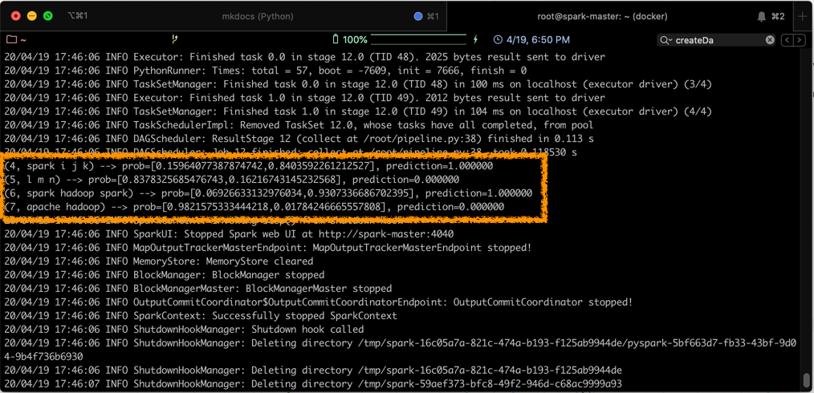

# Partie 7 - Spark MLLib
<center></center>

## Présentation de Spark MLLib
Spark MLLib[^spark-official] est la librairie d'apprentissage automatique (Machine Learning) de Spark. Son but est de rendre son utilisation facile et scalable. À un haut niveau d'abstraction, elle fournit des outils tel que:

  - Des algorithmes de machine learning classiques tel que la classification, régression, clustering et filtrage collaboratif.
  - L'extraction de caractéristiques (_Features_), transformation, réduction de dimensions et sélection
  - Les pipelines pour construire, évaluer et régler les pipelines ML.
  - La persistence, pour sauvegarder et charger des algorithmes, modèles et pipelines.
  - Des utilitaires tel que l'algèbre linéaire, statistiques, manipulation des données, etc.

A partir de la version 2.0 de Spark, la structure principale utilisée pour l'API MLlib est DataFrame, en opposition aux RDD, car son utilisation est plus intuitive et uniforme, et qu'elle facilite les transformations.

## Chargement des données
Nous allons montrer dans cette partie comment utiliser des sources de données pour charger des données avec MLLib. En plus des sources de données classiques tel que Parquet, CSV, JSON et JDBC, des sources spécifiques pour l'apprentissage numérique sont fournies, tel que la source de données pour les images (_image data source_).

Cette source de données est utilisée pour chager des images à partir d'un répertoire. Elle transforme les images compressées (jpeg, png, etc.) en représentation brute via la librairie Java **ImageIO**. Le DataFrame chargé admet une seule colonne de type _StructType_, appelé **image**, contenant les données de l'image stockées dans un schéma, comme suit:

<center>

|Nom      |Type           |Description                                   |
|---------|---------------|----------------------------------------------|
| ```origin``` | StringType | représente le chemin du fichier image|
|```height```   | IntegerType  | La hauteur de l'image  |
|```width```   | IntegerType  | La largeur de l'image  |
|```nChannels```   | IntegerType  | Le nombre de canaux de l'image  |
|```mode```   | IntegerType  | Le type compatible OpenCV  |
|```data```   | BinaryType  | Les octets de l'image dans un ordre compatible à OpenCV  |

</center>

Pour charger des fichiers images , une API en SparkSQL est fournie:

  ```scala
  val df = spark.read.format("image").option("dropInvalid", true).load("<chemin_du_répertoire_contenant_les_images>")
  ```
Un DataFrame sera alors créé, dont la structure est présentée dans le tableau précédent, contenant les informations relatives aux images contenues dans le répertoire donné.

## ML Pipelines
Les pipelines ML fournissent un ensemble uniforme d'APIs au dessus des DataFrames, permettant de créer et accorder (_tune_) des pipelines pratiques de machine learning.

### Définition des Pipelines
En machine learning, il est commun d'exécuter une séquence d'algorithmes pour traiter et apprendre à partir de données. Par exemple, un flux de traitement d'un document texte peut inclure les étapes suivantes:

  * Diviser chaque document en mots
  * Convertir chaque mot en vecteur de caractéristiques numériques
  * Créer un modèle prédictif en utiliser les vecteurs et les labels

MLLib permet de créer de tels flux (ou pipelines), en définissant une séquence de ```PipelineStage```s, composés de ```Transformer```s et de ```Estimator```s, qui doivent être exécutés dans un certain ordre.

  * ```Transformer```: Algorithme qui peut transformer un DataFrame en un autre DataFrame. Par exemple, un modèle ML est un ```Transformer``` qui transforme un DataFrame avec des caractéristiques (ou _features_), en un DataFrame avec des prédictions.
  * ```Estimator```: Algorithme qui peut être appliqué sur un DataFrame pour produire un ```Transformer```. Par exemple, un algorithme d'apprentissage est un ```Estimator``` qui s'entraîne sur un DataFrame pour produire un modèle.

### Fonctionnement des Pipelines
Un pipeline est un ensemble d'étapes, où chaque étape est soit un ```Transformer``` soit un ```Estimator```. Ces étapes sont exécutés dans l'ordre, et le DataFrame en entrée est transformé au fur et à mesure de son passage à travers ces étapes. Pour les étapes exécutant un ```Transformer```, la méthode _transform()_ est appelée sur le DataFrame, alors que pour les étapes exécutant un ```Estimator```, c'est la fonction _fit()_ qui est appelée, résultant en la création d'un ```Transformer```, qui à son tour, devient une partie de la Pipeline.

### Exemple de Pipeline
Pour illustrer le fonctionnement des Pipelines, l'exemple suivant est présenté:


Cette pipeline montre l'application d'un modèle de régression linéaire pour la prédiction de la valeur d'un label à partir d'un texte. La méthode ```Pipeline.fit()``` est initialement appelée sur le DataFrame originel (_Raw Text_),  qui contient des documents textes bruts et des labels. La méthode ```Tokenizer.transform()``` divise les documents texte en mots, en  rajoutant une nouvelle colonne contenant ces mots à la DataFrame. La méthode ```HashingTF.transform()``` convertit les mots en vecteurs de features. Ensuite, puisque ```LogisticRegression``` est un ```Estimator```, la pipeline appelle ```LogisticRegression.fit()``` pour créer le ```Transformer```: ```LogisticRegressionModel```, qui est à son tour utilisé pour produire un nouveau DataFrame contenant les prédictions.

L'exemple présenté ci-dessus est réalisé grâce au code suivant (ce code est écrit dans le langage Python):

  ```python
  from pyspark.ml import Pipeline
  from pyspark.ml.classification import LogisticRegression
  from pyspark.ml.feature import HashingTF, Tokenizer
  from pyspark.sql import SQLContext
  from pyspark import SparkContext

  sc = SparkContext(appName="Linear Regression Pipeline")
  spark = SQLContext(sc)

  # Préparer des documents de training à partir d'une liste de tuples (id, text, label). On remarque ici qu'un label =1 si la texte en question contient le mot spark
  training = spark.createDataFrame([
    (0, "a b c d e spark", 1.0),
    (1, "b d", 0.0),
    (2, "spark f g h", 1.0),
    (3, "hadoop mapreduce", 0.0)
  ], ["id", "text", "label"])

  # Configurer une pipeline, qui consiste en trois étapes: tokenizer, hashingTF, and lr.
  tokenizer = Tokenizer(inputCol="text", outputCol="words")
  hashingTF = HashingTF(inputCol=tokenizer.getOutputCol(), outputCol="features")
  lr = LogisticRegression(maxIter=10, regParam=0.001)
  pipeline = Pipeline(stages=[tokenizer, hashingTF, lr])

  # Adapter la pipeline aux documents de training.
  model = pipeline.fit(training)

  # Preparer les documents de test,qui ne sont pas labellisés, donc composés de tuples (id, text).
  test = spark.createDataFrame([
    (4, "spark i j k"),
    (5, "l m n"),
    (6, "spark hadoop spark"),
    (7, "apache hadoop")
  ], ["id", "text"])

  # Réaliser des prédictions sur les documents de test et afficher les colonnes significatives.
  prediction = model.transform(test)
  selected = prediction.select("id", "text", "probability", "prediction")
  for row in selected.collect():
    rid, text, prob, prediction = row
    print("(%d, %s) --> prob=%s, prediction=%f" % (rid, text, str(prob), prediction))
  ```
Pour exécuter ce code sur notre cluster, nous allons suivre les étapes suivantes:

  * Lancer le cluster spark:
  ```Bash
    docker start spark-master spark-slave1 spark-slave2
  ```
  * Vous connecter sur la machine master:
  ```Bash
    docker exec -it spark-master bash
  ```
  * Il faudra d'abord mettre en place l'environnement de votre cluster pour pouvoir exécuter le code en Python (dépassez ces étapes si vous avez déjà utilisé ```pyspark```). PySpark est la bibliothèque Python de Spark. Il faut suivre les étapes suivantes pour l'utiliser:
    - Insérer la variable d'environnement suivante dans le fichier ~/.bashrc: ```export PYSPARK_PYTHON=python3```. Pyspark utilisera ainsi la version 3 de python.
    - Charger cette variable en tapant ```source ~/.bashrc```
    - Installer le gestionnaire de packages ```pip3```: ```apt install python3-pip```
  * Certains packages sont manquants pour faire marcher votre code. Il faut installer les packages suivants:
      ```bash
        pip3 install numpy spark
      ```
  * Créer un fichier ```pipeline.py``` dans lequel vous allez copier le code présenté ci-dessous
  * Pour lancer votre application, exécuter:
  ```bash
    spark-submit pipeline.py
  ```

Le résultat de la prédiction s'affichera sur votre console, comme suit:



On remarque, d'après le résultat précédent, que notre pipeline a réussi sa prédiction, en affectant à chacune des phrases contenant le mot _spark_ une valeur de label égale à 1, ce qui était l'objectif de notre modèle.

## Références

  [^spark-official]:
  Spark Documentation, _Spark MLLib Guide_, [https://spark.apache.org/docs/latest/ml-guide.html](https://spark.apache.org/docs/latest/ml-guide.html), consulté le 04/2020
