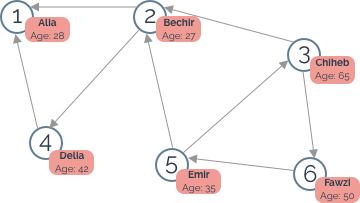
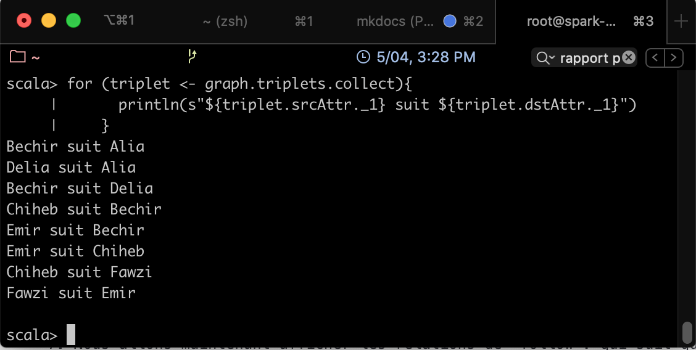

# Partie 8 - Spark GraphX
<center></center>

## Présentation de Spark GraphX
Spark GraphX[^spark-official] est un composant Spark permettant le traitement à base de graphes. A un niveau élevé, GraphX étend la structure Spark RDD en introduisant une abstraction sous forme d'un graphe dirigé formé de sommets (_vertex_) et d'arêtes (_edge_), auxquels sont attachées des propriétés.
Pour gérer ces structures, GraphX propose un ensemble d'opérateurs ainsi qu'une version optimisée de l'API [Pregel](https://spark.apache.org/docs/latest/graphx-programming-guide.html#pregel). De plus, plusieurs algorithmes et constructeurs (_builders_) sont définis pour simplifier le traitement et analyse de ces graphes.

### Graphes de Propriétés
Un graphe de propriétés est un multigraphe dirigé contenant des objets définis par l'utilisateur attachés à chaque sommet et arête. Un multigraphe est un graphe dirigé qui peut contenir plusieurs arêtes reliant les mêmes sommets source et destination, permettant ainsi de modéliser des situations où les sommets peuvent avoir plusieurs types de relations. Chaque sommet est représenté par un identifiant unique de 64 bits (_VertexId_). Les arêtes doivent avoir chacune un sommet source et un sommet destination.

Un graphe de propriété est paramétrisé par deux types: un sommet (_Vertex_ appelé _VD_) et une arête (_Edge_ appelé _ED_). Ces types optimisés remplacent les types classiques, même primitifs, de façon a réduire la taille en mémoire réservée.

Pour définir des types personnalisés pour les sommets, il est préférable d'utiliser l'héritage. Par exemple, pour définir des sommets de type _Utilisateur_ et d'autres de type _Produit_, on peut créer les classes suivantes:

```scala
  class VertexProperty()
  case class UserProperty(val name: String) extends VertexProperty
  case class ProductProperty(val name: String, val price: Double) extends VertexProperty
  // Le graphe peut alors avoir le type suivant:
  var graph: Graph[VertexProperty, String] = null
```

Un graphe de propriétés correspond à une paire de RDDs contenant des propriétés pour chaque sommet et arête. En conséquence, la classe _Graph_ contient des membres permettant d'accéder aux sommets et arêtes:

```scala
  class Graph[VD, ED] {
    val vertices: VertexRDD[VD]
    val edges: EdgeRDD[ED]
  }
```


Les classes ```VertexRDD[VD]``` et ```EdgeRDD[RD]``` sont des versions optimisées des RDD qui fournissent des fonctionnalités supplémentaires pour le traitement et optimisation des graphes.

Nous présentons dans ce qui suit un exemple de graphe de propriétés montrant plusieurs collaborateurs dans un projet de recherche:
<center></center>

En plus des sommets et arêtes du graphe de propriétés, GraphX présente également une vue en _triplet_. Cette vue permet de faire la jointure des propriétés des sommets et arêtes, équivalente à l'expression SQL suivante:

```sql
  SELECT src.id, dst.id, src.attr, e.attr, dst.attr
  FROM edges AS e LEFT JOIN vertices AS src, vertices AS dst
  ON e.srcId = src.Id AND e.dstId = dst.Id
```

Ceci correspond graphiquement à la figure suivante:
<center></center>

La classe ```EdgeTriplet``` étend la classe ```Edge``` en ajoutant les attributs ```srcAttr``` et ```dstAttr``` qui contiennent les propriétés source et destination. Le code ressemblera à ce qui suit:

```scala
  val graph: Graph[(String, String), String]
  // Utiliser les triplets pour créer un RDD de faits
  val facts: RDD[String] =  graph.triplets.map(triplet =>
    triplet.srcAttr._1 + " est le " + triplet.attr + " de " + triplet.dstAttr._1)
  facts.collect.foreach(println(_))
```

### Opérateurs GraphX
De même que pour les RDDs, les graphes de propriétés ont également un ensemble d'opérateurs qui prennent des fonctions définies par l'utilisateur et produisent de nouveaux graphes avec des propriétés et une structure modifiées.

Les opérateurs utilisés sont divisés en plusieurs types:

#### Opérateurs structurels
GraphX supporte quelques opérateurs qui modifient la structure du graphe:

  * ```reverse```: retourne un nouveau graphe avec toutes les directions des arêtes inversées.
  * ```subgraph```: retourne le sous-ensemble du graphe qui contient les sommets et arêtes respectant les contraintes définies en paramètre, ainsi que toutes les arêtes connectant les sommets respectant ces contraintes.
  * ```mask```: retourne un sous-graphe qui contient les sommets et arêtes qui existent aussi dans le graphe donné en entrée.

#### Opérateurs de jointure
Ces opérateurs permettent de joindre des données à partir de RDD externes avec des graphes. Deux opérateurs sont définis:

  * ```joinVertices```: joint les sommets avec le RDD en entrée et retourne un nouveau graphe avec les propriétés du sommet obtenues en appliquant la fonction ```map``` définie par l'utilisateur au résultat des sommets joints.
  * ```outerJoinVertices```: se comporte comme ```joinVertices``` mais la fonction ```map``` est appliquée à tous les sommets et peut changer le type de la propriété de l'arête.

#### Opérateurs d'agrégation et de voisinage
Les opérateurs d'agrégation permettent de réunir des information sur le voisinage de chaque sommet.

  * ```aggregateMessages``` applique une fonction définie par l'utilisateur ```sendMsg``` à chaque triplet du graphe et utilise la fonction ```mergeMsg```pour agréger ces messages dans leur sommet destination. Permet également de faire des opérations de type _map/reduce_  en remplaçant l'opérateur ```mapReduceTriplets``` qui existait dans les anciennes versions de GraphX.
  * ```collectNeighborIds``` et ```collectNeighbors```: permettent de collecter les sommets et les attributs voisins d'un sommet donné.
  * ```degrees```, ```inDegrees``` et ```outDegrees```: permettent de calculer le degré de chaque sommet, c'est à dire le nombre d'arêtes qui lui sont liées.


### Caractéristiques de Spark GraphX

  1. **Flexibilité**: GraphX utilise les graphes pour le traitement. Il unifie les opérations d'ETL (_Extract, Transform and Load_), l'analyse exploratoire et le traitement itératif dans un seul système.
  2. **Vitesse**: Spark GraphX fournit une performance comparable aux systèmes de traitement de graphes spécialisés les plus performants.
  3. **Bibliothèque en expension**: la bibliothèque de Graphx est en continuelle expension, et fournit des algorithmes prêts à l'emploi tel que _PageRank_, _SVD_, etc.

## Exemple d'Application GraphX
Nous allons implémenter dans cet exemple (inspiré du tutoriel dans [^edureka]), un petit réseau social entre plusieurs personnes, tel que représenté dans l'image suivante:
<center></center>

Nous allons utiliser spark shell et le langage Scala pour cet exemple.

  1. Lancer votre cluster spark, entrer dans le contenaire master, et lancer spark-shell:
  ```bash
    docker start spark-master spark-slave1 spark-slave2
    docker exec -it spark-master bash
    spark-shell
  ```
  2. Commencer par importer les classes nécessaires:
  ```scala
    import org.apache.spark._
    import org.apache.spark.rdd.RDD
    import org.apache.spark.util.IntParam
    import org.apache.spark.graphx._
    import org.apache.spark.graphx.util.GraphGenerators
  ```
  3. Créer les tableaux contenant les sommets et les arêtes:
  ```scala
    val sommets= Array  ((1L,("Alia",28)),(2L,("Bechir",27)),(3L,("Chiheb",65)),
                        (4L,("Delia",42)),(5L,("Emir",35)),(6L,("Fawzi",50)))
    val aretes = Array (Edge(2,1,"follows"),Edge(4,1,"follows"),Edge(2,4,"follows"),Edge(3,2,"follows"),
                        Edge(5,2,"follows"),Edge(5,3,"follows"),Edge(3,6,"follows"),Edge(6,5,"follows"))
  ```
  4.Créer les RDD associé en parallelisant les tableaux précedents:
  ```scala
    val sommetRDD: RDD[(Long, (String, Int))] = sc.parallelize(sommets)
    val areteRDD: RDD[Edge[String]] = sc.parallelize(aretes)
  ```
  5. Constuire le graphe à partir des RDD:
  ```scala
    val graph: Graph[(String, Int), String] = Graph(sommetRDD, areteRDD)
  ```
  6. Nous allons ensuite afficher la liste des personnes ainsi que leurs ages:
  ```scala
    graph.vertices.filter { case (id, (nom, age)) => age > 30 }.collect.foreach { case (id, (nom, age)) => println(s"$nom a $age ans")}
  ```
  Le résultat obtenu ressemble à ce qui suit:
<center></center>
  7. Nous allons maintenant afficher les relations de "follow": qui suit qui? Pour cela, écrire le code suivant:
  ```scala
    for (triplet <- graph.triplets.collect){
      println(s"${triplet.srcAttr._1} suit ${triplet.dstAttr._1}")
    }
  ```
    Le résultat obtenu ressemble à ce qui suit:
  <center></center>
  8. Trouvons le nombre d'abonnés pour chaque utilisateur:
  ```scala
    // Définir une classe pour modéliser un utilisateur
    case class Utilisateur(nom: String, age: Int, inDeg: Int, outDeg: Int)
    // Créer un graphe pour l'utilisateur
    val initialUserGraph: Graph[Utilisateur, String] = graph.mapVertices{ case (id, (nom, age)) => Utilisateur(nom, age, 0, 0) }

    // Remplir les informations
    val userGraph = initialUserGraph.outerJoinVertices(initialUserGraph.inDegrees) {
          case (id, u, inDegOpt) => Utilisateur(u.nom, u.age, inDegOpt.getOrElse(0), u.outDeg)}.outerJoinVertices(initialUserGraph.outDegrees) {
          case (id, u, outDegOpt) => Utilisateur(u.nom, u.age, u.inDeg, outDegOpt.getOrElse(0))
    }
    // Afficher les résultats
    for ((id, prop) <- userGraph.vertices.collect) {
      println(s"Utilisateur $id s'appelle ${prop.nom} et est suivi par ${prop.inDeg} personnes.")
    }
  ```
  Le résultat obtenu ressemble à ce qui suit:
  <center></center>

    9. Et si on veut afficher l'abonné le plus âgé?
    ```scala
      // Chaque abonné envoie un message avec son age (c'est le deuxième attribut detype Int du sommet en question) => équivalent de la fonction map
      def msgFun(triplet:EdgeContext[(String,Int),String,Int]){
        triplet.sendToDst(triplet.srcAttr._2)
      }

      // Pour chaque couple d'âges reçus, retenir la valeur la plus grande => équivalent de la fonction reduce
      def reduceFun(a:Int,b:Int):Int = if (a > b) a else b

      // Exécuter les deux opérations pour chaque triplet du graphe
      val result = graph.aggregateMessages[Int](msgFun, reduceFun)

      // Afficher le résultat obtenu
      result.collect.foreach { case (id, age) => println(s"L'abonne le plus age de l'utilisateur $id a $age ans")}
    ```
    Le résultat obtenu ressemble à ce qui suit:
    <center></center>

## Références

  [^spark-official]:
  Spark Documentation, _Spark GraphX Guide_, [https://spark.apache.org/docs/latest/graphx-programming-guide.html](https://spark.apache.org/docs/latest/graphx-programming-guide.html), consulté le 05/2020

  [^edureka]:
  Edureka, _Spark GraphX Tutorial – Graph Analytics In Apache Spark_, [https://www.edureka.co/blog/spark-graphx/](https://www.edureka.co/blog/spark-graphx/), consulté le 05/2020
